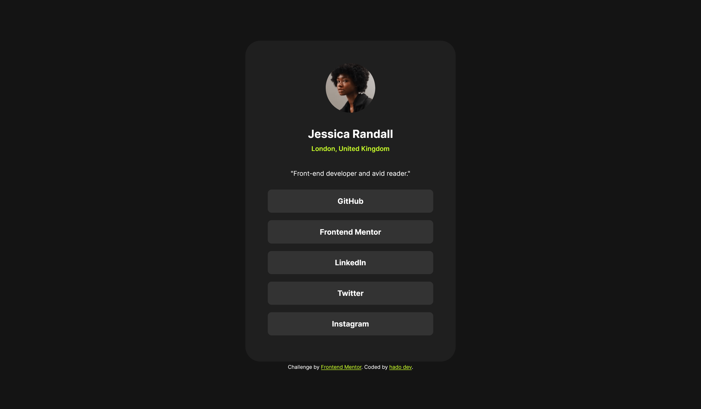
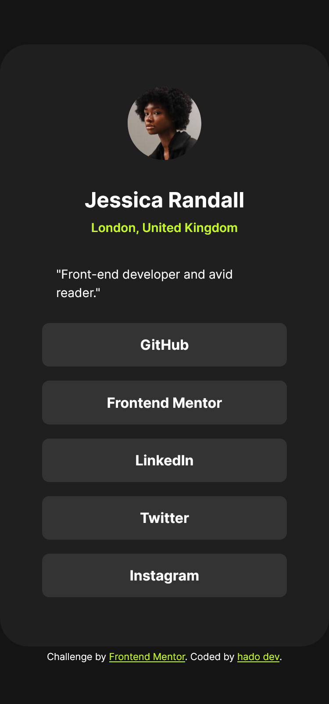

# Frontend Mentor - Social links profile solution

This is a solution to the [Social links profile challenge on Frontend Mentor](https://www.frontendmentor.io/challenges/social-links-profile-UG32l9m6dQ). Frontend Mentor challenges help you improve your coding skills by building realistic projects. 

## Table of contents

- [Overview](#overview)
  - [The challenge](#the-challenge)
  - [Screenshot](#screenshot)
  - [Links](#links)
- [My process](#my-process)
  - [Built with](#built-with)
  - [What I learned](#what-i-learned)
  - [Useful resources](#useful-resources)
- [Author](#author)
- [Acknowledgments](#acknowledgments)

**Note: Delete this note and update the table of contents based on what sections you keep.**

## Overview

### The challenge

Users should be able to:

- See hover and focus states for image and links.

### Screenshot




### Links

- Solution URL: https://github.com/hadodev/SocialLinkProfile.git
- Live Site URL: https://hadodev-frontendmentor-sociallink.netlify.app/

## My process

### Built with

- Semantic HTML5 markup
- CSS custom properties for colors and font settings
- Use flexbox for the card class
- Transitions on hover and focus: image and links
- Use clamp() function for responsive design


### What I learned

Use of variables fonts with fallback based on static fonts:

```css
@font-face {
    font-family: 'Inter';
    src: local('Inter Regular'), local('Inter-Regular'),
         url('../fonts/static/Inter-Regular.woff2') format('woff2'),
         url('../fonts/static/Inter-Regular.woff') format('woff'),
         url('../fonts/static/Inter-Regular.ttf') format('truetype');
    font-weight: 400;
    font-style: normal;
    font-display: swap;
}

@font-face {
    font-family: 'Inter';
    src: local('Inter SemiBold'), local('Inter-SemiBold'),
         url('../fonts/static/Inter-SemiBold.woff2') format('woff2'),
         url('../fonts/static/Inter-SemiBold.woff') format('woff'),
         url('../fonts/static/Inter-SemiBold.ttf') format('truetype');
    font-weight: 600;
    font-style: normal;
    font-display: swap;
}

@font-face {
    font-family: 'Inter';
    src: local('Inter Bold'), local('Inter-Bold'),
         url('../fonts/static/Inter-Bold.woff2') format('woff2'),
         url('../fonts/static/Inter-Bold.woff') format('woff'),
         url('../fonts/static/Inter-Bold.ttf') format('truetype');
    font-weight: 700;
    font-style: normal;
    font-display: swap;
}

@supports (font-variation-settings: normal) {
    @font-face {
    font-family: "Inter";
    src:
        url("../fonts/Inter-Regular.woff2") format(woff2) tech(variations),
        url("../fonts/Inter-Regular.woff2") format("woff2-variations");
    font-weight: 400 600 700;
    font-stretch: 50% 200%;
    }
}
```

### Useful resources

- [CSS reset](https://piccalil.li/blog/a-more-modern-css-reset/) - This helped me moder CSS reset.


## Author

- GitHub - [Hado Dev](https://piccalil.li/blog/a-more-modern-css-reset/)
- Frontend Mentor - [@hadodev](https://www.frontendmentor.io/profile/yourusername)


**Note: Delete this note and add/remove/edit lines above based on what links you'd like to share.**

## Acknowledgments

For all authors who publish open source ressources and contents freely available and make Internet more awesome.
